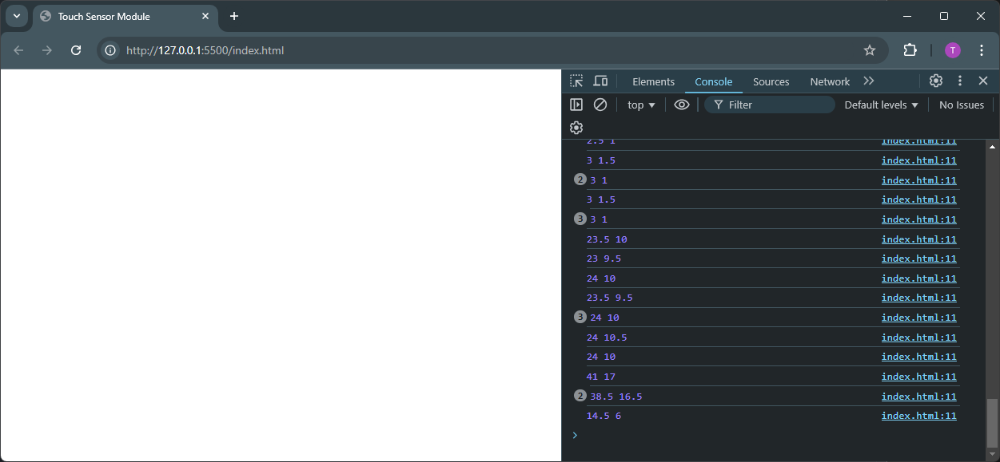

# touch-radius-minimal-reproducible-example

1. Open `index.html` in a Browser
2. Open the Browser-DevTools (F12)
3. Draw something via touch
4. The console output shows the X/Y-Radius

Expected behavior:

